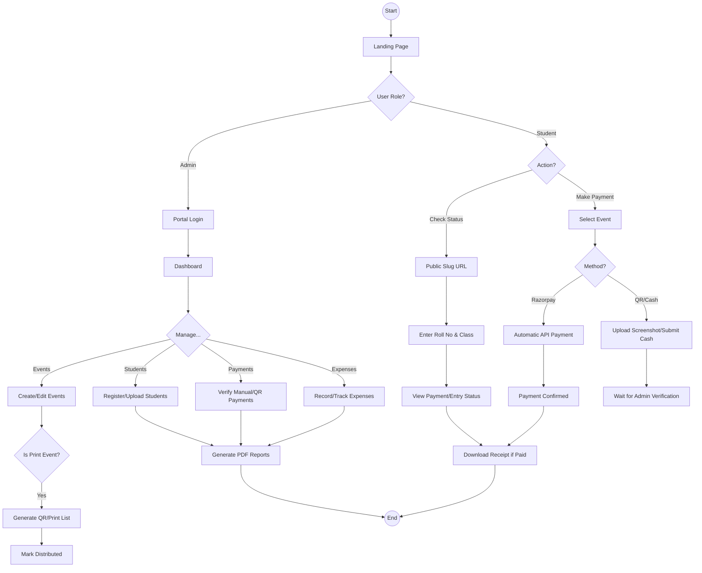
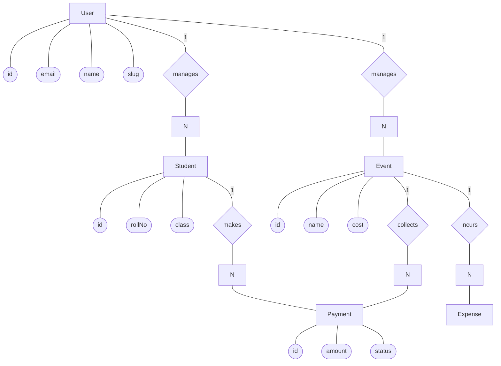
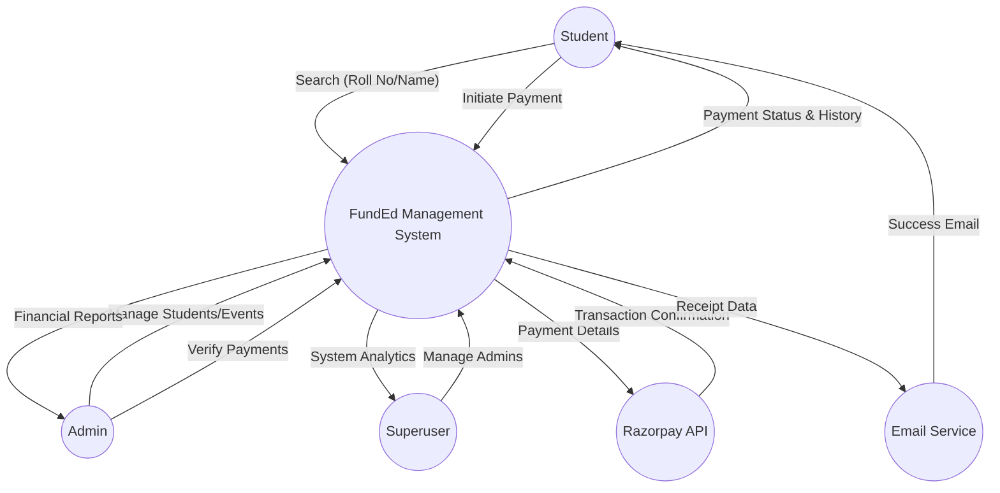
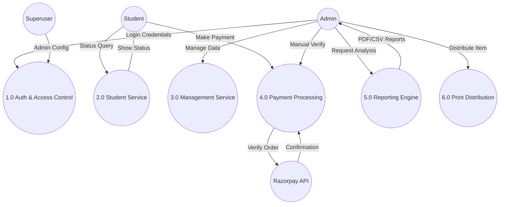
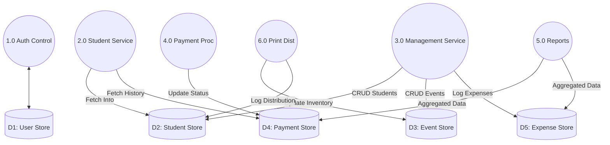
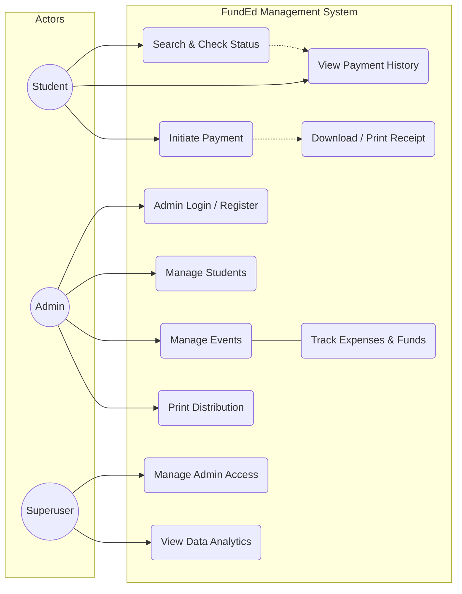
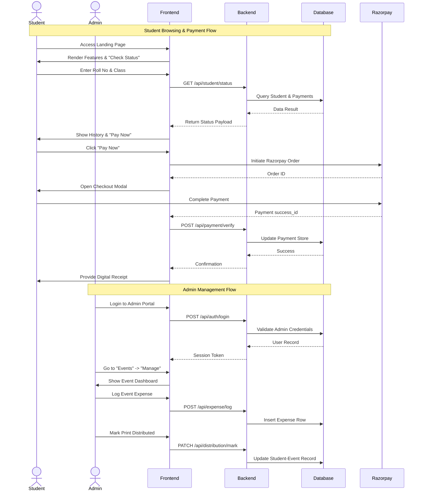
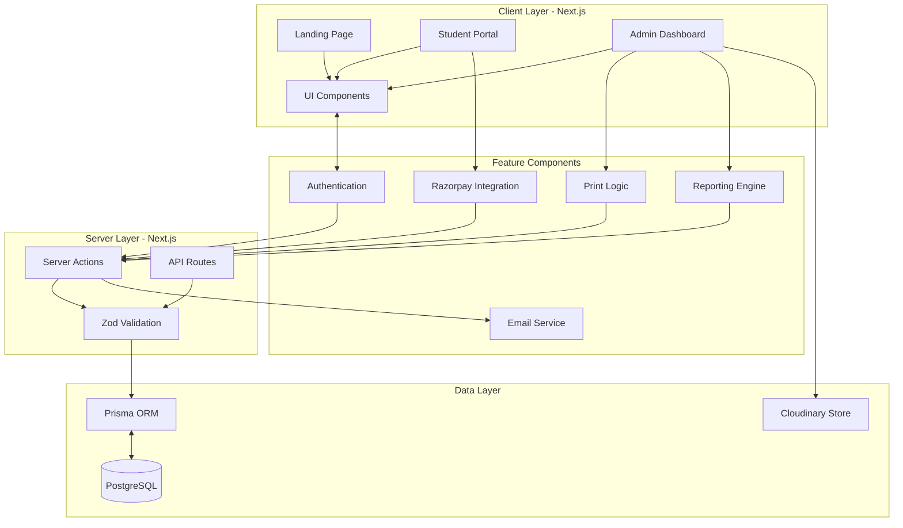

# FundEd-Web: Project Diagrams

This document presents a comprehensive set of diagrams illustrating the architecture, data flow, and user interactions of the FundEd-Web application.

---

## 1. Activity Diagram
This diagram outlines the primary workflows for both Administrators and Students.

---

## 2. Entity Relationship (ER) Diagram
*Chen Notation Style: Entities in Rectangles, Attributes in Ellipses.*

---

## 3. Data Flow Diagram (Level 0: Context Diagram)

---

## 4. Data Flow Diagram (Level 1: Functional Decomposition)

---

## 5. Data Flow Diagram (Level 2: Detailed Data Flow)

---

## 6. Use Case Diagram
*Detailed mapping with professional Actors and System Boundary.*

---

## 7. Global Sequence Diagram
*Comprehensive end-to-end site flow covering Students and Admins.*

---

## 8. System Architecture
*Detailed Component & Feature Architecture.*

